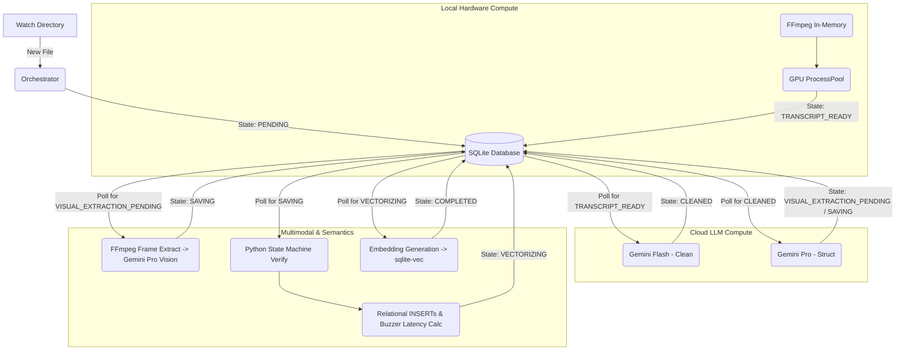

# System Architecture

## 1. Overview
Trebek is a high-performance, fault-tolerant pipeline that orchestrates local GPU compute, cloud-based LLM APIs, Multimodal Computer Vision, and Semantic Vector Search. The core architectural philosophy is **Database-Driven State Machine** rather than a fragile in-memory queue system. This guarantees true resumability, prevents thread-to-async deadlocks, and explicitly manages memory constraints.

## 2. Core Paradigms

### A. Database-Backed Queueing (True Resumability)
To ensure zero data loss during long-running tasks or API rate limits, we completely eliminate `asyncio.Queue` passing between the GPU stages and the LLM stages.
* **The "Zero-Disk" Pivot:** While we avoid writing raw `.wav` files to prevent SSD wear, the highly valuable output of the GPU (the raw WhisperX JSON) **must** be persisted immediately.
* **Mechanism:** The SQLite `pipeline_state` table acts as our persistent queue. To avoid IPC and database bloat bottlenecks, the GPU stage writes its massive JSON transcript to a local compressed file (`.json.gz`) and saves only the filepath reference to a `TEXT` column in SQLite, updating the file's state to `TRANSCRIPT_READY`. The LLM stages independently poll the database for files in this state. 
* **Benefit:** If the Gemini API hits a `429 Rate Limit` and sleeps for an hour, the GPU continues churning through the video backlog at maximum speed, safely saving its work to disk. If the system crashes, restarting it picks up exactly where it left off.

### B. SQLite Actor Pattern
SQLite is exceptional for concurrent reads (via WAL mode) but strictly limits concurrent writers. To prevent `database is locked` exceptions caused by multiple pipeline stages attempting to update states simultaneously, we implement the **Actor Pattern**.
* A single, dedicated `DatabaseWriter` asyncio task is created at system startup.
* All pipeline stages push their SQL `UPDATE` and `INSERT` commands to an internal, memory-bound `asyncio.Queue` owned by the `DatabaseWriter`.
* **Crucially**, to prevent "False Resumability" (where a crash happens before a transaction commits), pipeline stages must pass an `asyncio.Future` in the payload and `await` it. The stage blocks until the `DatabaseWriter` physically commits to the WAL and resolves the future.
* The `DatabaseWriter` executes these sequentially, guaranteeing zero write contention. It wraps its internal transaction processing loop in a `try/finally` block. If the writer crashes, it iterates through its internal queue and forcefully calls `.set_exception()` on all pending `asyncio.Future` objects to prevent deadlocks. Furthermore, all downstream `await future` calls from pipeline stages are wrapped in `asyncio.wait_for()` to guarantee they never hang indefinitely.
* To avoid race conditions, workers poll the database using an atomic SQLite 3.35+ query: `UPDATE pipeline_state SET status = 'PROCESSING' WHERE episode_id = (SELECT episode_id FROM pipeline_state WHERE status = 'TRANSCRIPT_READY' LIMIT 1) RETURNING episode_id;`.
* SQLite is configured at startup with `PRAGMA journal_mode=WAL; PRAGMA busy_timeout=5000; PRAGMA auto_vacuum=INCREMENTAL;`. A background `asyncio` task runs `PRAGMA incremental_vacuum;` every 5 minutes to prevent database file bloat without blocking pipeline throughput.

## 3. Execution Modes
The application supports two modes of execution, both leveraging the identical database-backed architecture:

1. **Always-On Daemon (Watch Mode):** A background process uses `watchdog` on a designated `WATCH_DIR`. It instantly registers new files as `PENDING` in the database and triggers the pipeline.
2. **One-Time Pass (Batch Mode):** A CLI command that scans the `WATCH_DIR`, registers unprocessed files, runs the pipeline until all states are `COMPLETED`, and exits cleanly.

## 4. High-Level Diagram

